# CS 474 : HW4 by Rishabh Goel

**Scaset** is a DSL(Domain Specific Language) developed for people who study Set Theory. This language will help people to run various set operations. 

Operations included:

| OPERATION | DESCRIPTION | FEATURE_VERSION |
| :-------------: |:------------:| :-------------:|
| `Value(2).eval()`      | Get the value of the item passed | Assignment 1 |
| `Variable("A").eval()`      | Get the value of a variable | Assignment 1 |
| `Assign("A", Value(Set(1,2,3))).eval()` | Assign value to a set | Assignment 1 |
| `Insert(Variable("A"), Value(4)).eval()` | Insert in a set | Assignment 1 |
| `Delete(Variable("A"), Value(2)).eval()` | Delete from a set | Assignment 1 |
| `Check(Variable("A"), Value(3)).eval()` | Check element in a set | Assignment 1 |
| `Union(Variable("A"), Variable("B")).eval()` | Union of 2 sets | Assignment 1 |
| `Intersection(Variable("A"), Variable("B")).eval()` | Intersection of 2 sets | Assignment 1 |
| `Diff(Variable("A"), Variable("B")).eval()` | Symmetric Difference of 2 sets | Assignment 1 |
| `Cross(Variable("A"), Variable("B")).eval()` | Cartesian Product of 2 sets | Assignment 1 |
| `SetMacro("delete", Delete(Variable("A"), Value(1))).eval()` | Initialize a Macro | Assignment 1 |
| `GetMacro("delete").eval()` | Fetch a Macro by name | Assignment 1 |
| `Scope(Union(Variable("A"), Variable("B"))).eval()` | Compute result in default scope | Assignment 1 |
| `ClassDef("itemName", Private(Field("f1")), Constructor(Assign("f1", Value(5))), Public(CreateMethod("m1", Params("a", "b"), Assign("c", Union(Variable("a"), Variable("b"))), Variable("c")))).eval()` | Class definition with fields, constructors and methods | Assignment 2 |
| `Public(Field("f")).eval(), Private(Field("g")).eval(), Protected(Field("h")).eval()` | Access modifiers for fields(Similarly for methods) | Assignment 2 |
| `InnerClass("outerClassName", "innerClassName").eval()` | Creates an inner class(innerClassName) inside the outer class(outerClassName) | Assignment 2 |
| `NewObject("itemName", Variable("objName"), Params("fieldName"), ListBuffer(Value(50))).eval()` |  Creates an object(objName) for class(itemName) and assigns 50 to fieldName through a constructor| Assignment 2 |
| `NewObject("innerInterface", Variable("innerObj"), Params("innerField"), ListBuffer(Value(0)), "objName").eval()` | Creates an object(innerObj) for inner class(innerInterface) and assigns 0 to innerField through a constructor. Done only if parent class object(objName) already created | Assignment 2 |
| `ClassDef("DerivedClass") Extends ClassDef("ParentClass")` | DerivedClass inherits members of ParentClass | Assignment 2 |
| `InvokeObject(Value("itemName"), Value("objName"), Value("methodName"), Value(Set(1,2)), Value(Set(3,4))).eval()` | Invokes the method(methodName) of class(itemName) using an object(objName) | Assignment 2 |
| `InvokeObject(Value("itemName"), Value("objName"), Value("fieldName"))` | Fetches the value of field(fieldName) of class(itemName) using an object(objName) | Assignment 2 |
| `AbstractClassDef("AbstractClass1", Private(Field("f1")), Public(CreateMethod("m1", Params("a", "b"))), Public(CreateMethod("m2", Params("a", "b"), Assign("c", Union(Variable("a"), Variable("b"))), Variable("c")))).eval()` | Creates an abstract class with concrete method and abstract method | Assignment 3 |
| `Interface("MyInterface", Public(CreateMethod("m4", Params("a", "b")))).eval()` | Creates an interface with just method definition | Assignment 3 |
| `ClassDef("TestClass2") Implements Interface("MyInterface")` | Concrete class implements methods of an interface | Assignment 3 |
| `If(Check(Variable("E"), Value(10)), Then(Assign("E", Value(Set(1)))), Else(Assign("E", Value(Set(1,5,6,10))))).eval()` | If-Then-Else Condition | Assignment 4 |
| `ExceptionClassDef("ExceptionClass", Field("Reason")).eval()` | Exception Class | Assignment 4 |
| `ThrowException(ExceptionClassDef("AnotherExceptionClass"), "Check Failed").eval()` | Throw Exception | Assignment 4 |
| `CatchException(ExceptionClassDef("AnotherExceptionClass").eval()` | Catch Exception | Assignment 4 |
| `PartialResult(Variable("x")).eval()` | Partial Result | Assignment 5 |
| `MonadsOptimize(Intersect(Variable("x"), Variable("x"))).map(func)` | Monadic Map function | Assignment 5 |

## <u>Instructions to Execute</u>

### <u>Testcases</u>
#### Using IntelliJ
1. Clone the repository from GitHub
2. Open the project using IntelliJ.
3. Run the testcases to see the result.

#### Using Command Line
1. Navigate to the project folder
2. Run the test cases using the command - `sbt clean compile test`

### <u>User execution</u>
#### Using IntelliJ

Import the following dependencies into your code:
   1. `import com.rishabh.hw4.Computation.*`
   2. `import com.rishabh.hw4.Computation.SetExp.*`
   3. `import scala.collection.mutable.*`

## <u>Files Used</u>

* **Computation**: Create DSL for Set Operations
* **ComputationTest**: Test DSL for Set Operations

## <u>Code Structure</u>

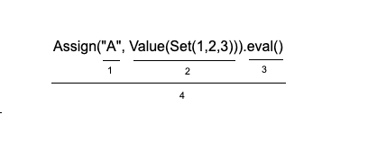

1. Variable name
2. Value to be assigned with the variable name
3. Entry point to the function with default scope
4. Assigns Set(1,2) to the variable A i.e A -> Set(1,2) in default scope

---
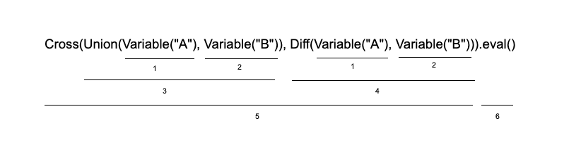

1. Fetch the value of variable A assigned using syntax from image 1
2. Fetch the value of variable B assigned using syntax from image 2
3. Perform Union of sets A and B
4. Perform Symmetric Difference of sets A and B
5. Cartesian product of the sets obtained as result of step 3 and 4
6. Sets the result in default scope

---

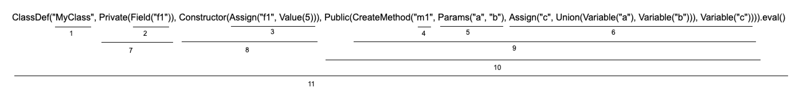

1. Define the classname
2. Field f1 with default value as null is created
3. Field f1 is assigned 5 inside the constructor
4. Method with name m1 is created
5. It has formal parameters as 'a' and 'b'
6. Function definition assigns the result of Union operation using formal variables to 'c' and return the value of variable 'c'
7. Field f1 is created as a private variable
8. Field f1 is assigned 5 inside the constructor
9. Method is created with method name, the parameters and the definition
10. Method m1 is created as a public method
11. Class with name MyClass is created with field f1, method m1 and a constructor that assigns value to field f1 

---

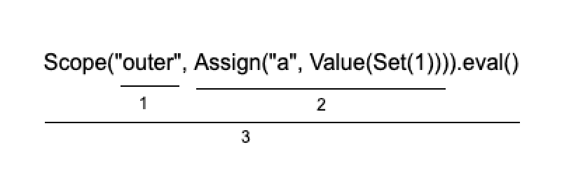

1. Scope with name 'outer' is created
2. Variable 'a' is assigned value Set(1) inside Scope
3. Scope is evaluated

---
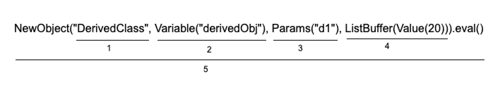

1. Create an object of DerivedClass
2. Create an object called derivedObj
3. Pass the field of the class we want to initialize in the constructor 
4. Pass the values of the fields wrapped inside a ListBuffer
5. NewObject enum creates an object of DerivedClass and initializes d1 with value 20

---

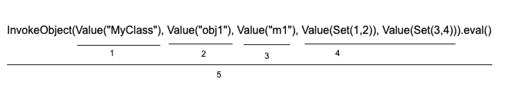

1. Class name whose object we want to invoke
2. Name of the object we want to invoke
3. The name of the method we want to invoke
4. Values we want to pass to the method
5. Invoke Object enum uses obj1 of class MyClass to invoke method m1 with inputs Set(1,2) and Set(3,4) to the method and computes their Union and returns the result

---

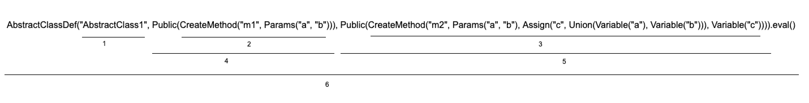

1. Name of the abstract class
2. Abstract Class contains abstract method `m1`
3. Abstract class contains concrete method `m2` that performs union of 2 sets
4. Method `m1` is created with Public access modifier
5. Method `m2` is created with Public access modifier
6. AbstractClassDef is executed using the eval method 

---

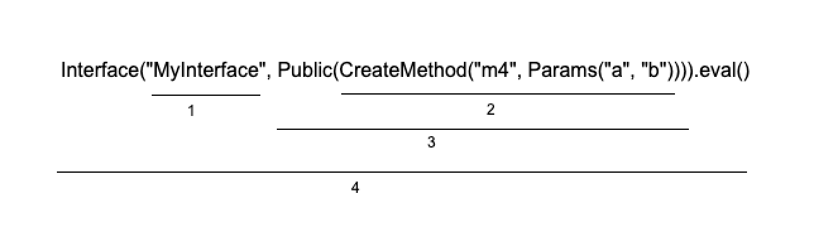

1. Name of the interface
2. Create a method `m4` which just has the method declaration
3. Method `m4` has Public access modifier
4. Interface is executed using the eval method

---

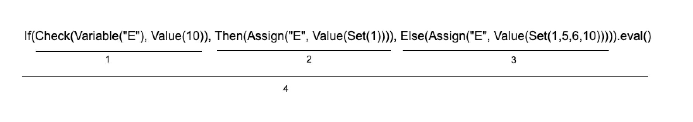

1. Check the condition inside the If statement
2. Evaluate Then code block if the check condition is true
3. Evaluate Else code block if the check condition is false
4. Evaluate the If-Then-Else statement

---

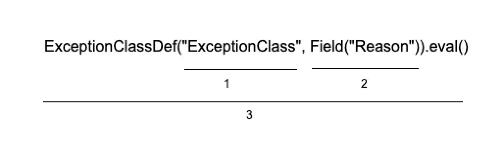

1. Name of the Exception class
2. A field to hold the Exception message
3. Create an Exception class

---

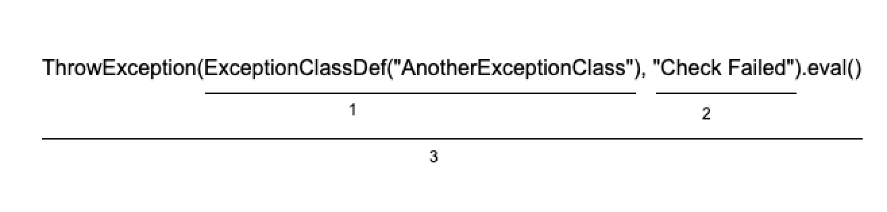

1. Fetch the field created inside the Exception class to hold the exception message
2. Exception message to be assigned
3. Evaluate the Throw Exception statement

---

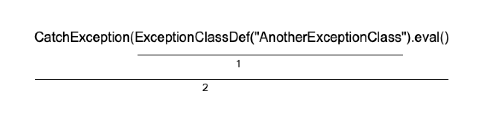

1. Fetches the exception message and returns the output
2. Evaluate the Catch Exception statement

---

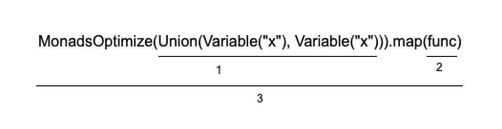

1. Input function that needs to be optimized
2. Optimizer function (Example provided in testcases)
3. Optimizes the input to Variable("x")

---

## <u>Points to remember</u>

1. Inner class object cannot access Outer class object
2. Outer class object cannot access Inner class object
3. If methods or fields are not provided with public, private or protected access modifier, they won't be accessible by the class object as they are not being tracked (Future work: Such variables to have public access by default)
4. Please provide all necessary parameters(Can be looked up from the table at the starting of README). Otherwise it will result in exception
5. Inner class is not inherited in child class. For eg. Class2 is inside Class1 and now Class3 tries to inherit members of Class1, then members of Class2 won't be inherited.
6. If Parent and Child class have same field or method, then field or member of Parent class is lost forever and we cannot access it through object of child class. But we can still access fields or methods of parent class using it's own object
7. Private members are not inherited.
8. Child classes can inherit from only 1 class
9. Only 1 inner class can be created
10. Make sure both class are created before you make one class as inner of another
11. Make sure both class are created before you inherit members of one class in another
12. `Extends` and `Implements` are the only functions that doesn't use `.eval()`
13. A class/interface cannot extend itself
14. An interface can inherit from an abstract class with all pure methods
15. An interface cannot implement another interface
16. A class cannot implement two or more different interfaces that declare methods with different signatures
17. An abstract class can inherit from another abstract class and implement interfaces where all interfaces and the abstract class have methods with the same signatures
18. An abstract class can implement interfaces
19. An abstract class can inherit from a concrete class
20. An exception is caught only if that exception has been thrown
21. Exception Class needs to be created first before throwing or catching an exception
22. Always create 1 field inside the Exception class definition to hold the exception message
23. If for some expression, value of a variable is not present, then it will result a partial evaluation (Refer testcases)